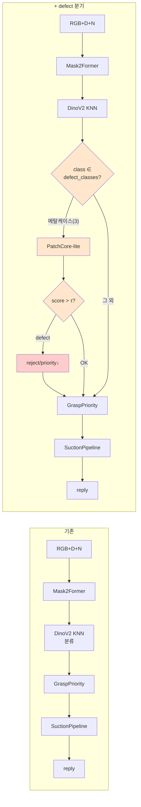

# PROJECT_LOG — picknplace 작업 일지

> sim jaehyung 작업 기록. 시간순 누적. 결정·이슈·발견·다음 액션.  
> 곁다리 정보: [`data_and_env.md`](data_and_env.md) (데이터/환경 사양), [`experiments.md`](experiments.md) (실험 결과 표).

---

## 2026-06-05 (세션 1: 환경 셋업 + 데이터 분석 + 변환 + 캘리브 검증 + 불량탐지 기획)

### 1. 코드 업로드 & 압축 해제
- 로컬 Windows 노트북에서 `picknplace-scratch.zip` → `goulash@166.104.250.101:~/`로 scp 업로드
- `~/picknplace-scratch/picknplace-scratch/`에 풀림 (디렉토리 한 번 중첩됨)
- 폴더 구조: `runner/` (수정 금지, gRPC transport) + `src/` (학생 구현 영역) + `configs/` + `cmes_inference.py` 진입점

### 2. 가상환경 생성 (`picknplace`)
- README 지시 그대로: `conda create -n picknplace python=3.9 -y` → `pip install -r requirements.txt`
- 위치: `/home/goulash/miniconda3/envs/picknplace`
- 핵심 패키지: grpcio 1.80.0, protobuf 3.20.3, numpy 1.26.4, opencv 4.11, open3d 0.17, torch 2.8.0+cu128, transformers 4.57.6, safetensors 0.7.0

### 3.  이슈: torch import 시 CUDA 자동 스캔 실패
- `CUDA_VISIBLE_DEVICES`가 비어 있으면 torch 2.8이 모든 디바이스 capability 체크 중 `device=3, num_gpus=3` 에러로 죽음
- 워크어라운드: 모든 torch 실행 전 `CUDA_VISIBLE_DEVICES=0` 명시

### 4. 샘플 데이터 업로드 (Zivid 2+ MR130)
- `sample_data/0000000758_20260529_150841.{bmp,ply,_data.json,_info.json}` — 1샘플

### 5. 코드 구조 파악 (모두 우리 데이터에 맞춰져 있음)
- gRPC 입력 파일 IO: `./img/rgb.png` + `depth.png` (uint16 mm) + `normal.bin` (int32 헤더 + float32 raw)
- PickNPlace.run() 시그니처, baseline detector(Mask2Former) / classifier(DinoV2 KNN) / GraspPriority / SuctionPipeline 다 들어있음
- yaml(`pick_n_place.yaml`) 값(focal=2013, ROI [150.822, 1186.162, 0, 866])이 sample_data와 정확히 매칭
- 컨벤션 확정: `extrinsic` = T_robot_from_camera (suction_pipeline.py:182)

### 6. 캘리브레이션 값 입력 (사용자 제공)
- `calibration.yaml`: cal_x/y/z/rx/ry/rz, rotation_order=xyz. `cal_rz` -87.351 → -89.351 덮어씀

### 7. 노트 시스템 구축
- `notes/PROJECT_LOG.md` (이 파일) + `experiments.md` + `data_and_env.md`

### 8. 시각화 원칙 설정
- headless → matplotlib `Agg`, plotly HTML. `outputs/figs/*.png`, `outputs/html/*.html`.

### 9. 시각화 헬퍼 모듈 (`src/utils/viz.py`)
- save_fig, save_html, normal_to_rgb, four_panel_rgbd, point_cloud_html, frame_axes_html

### 10. Exp #1 — PLY sanity check
- depth finite 78.63%, range 337–1830mm (p50 1044)
- **normal mean(nz)=-0.836**: Zivid 컨벤션은 **surface→camera** (-z 디폴트)
- 산출물: `outputs/figs/exp01_ply_sanity.png`, `outputs/html/exp01_pointcloud.html`

### 11. PLY → gRPC 입력 형식 변환 어댑터
- `zivid_loader.py:write_image_inputs` — rgb.png + depth.png(uint16 mm) + normal.bin
- 1샘플 변환 → `./img/` 생성 (1.6MB + 199KB + 15MB)

### 12. Exp #2 — 캘리브레이션 검증
- 역변환: GT `[-846, 55, -51]` → pixel `(651, 622)` in_image 
- 정변환 round-trip: **‖Δ‖ = 5.98 mm** (XY ±0.17, Z -5.98)
- **결론: 캘리브레이션 정확.** Z 5.98mm 잔차는 **suction tip offset (의도된 값, 사용자 확인됨)**
- 산출물: `outputs/figs/exp02_calib_overlay.png`, `outputs/html/exp02_frames.html`

### 13. 시스템 컨벤션 확인 (사용자, 2026-06-05)
- `class_id` 매핑 (영어 알파벳 순, 5개 클래스 + unknown):
  - **0 = bottle (물병)**
  - 1 = haribo (하리보)
  - 2 = jelly (젤리)
  - 3 = **metal_case (메탈케이스)** ← 결함 탐지 최우선 타겟
  - 4 = pencil_case (필통)
  - 5 = unknown
- suction tip offset = 6mm (정상 값, 보정 금지)

### 14. 불량탐지 기획 (대화 기반)
**문제 정의:**
- 현재 DinoV2 KNN classifier가 unknown(=5) 거름망 역할은 잘 함
- 추가 필요: 알려진 클래스 안에서 **결함(스크래치, 뜯어짐) 탐지**
- 제약: PatchCore 본격 학습할 시간 없음

**분석 결론 (대화 정리):**
-  **DinoV2 image-level KNN score 단독**: 안 됨. high-level semantic은 "이건 하리보"는 잘 구분하지만 "뜯어진 하리보"는 거의 같은 score
-  **RGB Laplacian 단독**: 안 됨. 정상 자체의 reflection/highlight/패턴이 더 큰 신호. 조명 변동에 폭망. threshold 못 잡음
-  **PatchCore on deformable 객체 (하리보, 젤리)**: 정상 variance(구겨짐 등)가 무한해서 memory bank로 못 담음 → false positive 폭주
-  **PatchCore on rigid 객체 (메탈케이스)**: sweet spot. 정상 표면 일정 + 결함은 sharp gradient. **학습 0**, reference set만 모으면 됨

**최종 방향 결정:**
- **메탈케이스(class 3)에만 PatchCore-lite 적용 (클래스 선택적)**
- 다른 클래스는 bypass (false positive 위험 0)
- DinoV2 backbone 재활용 → mid-level patch features → memory bank (FAISS or numpy) → per-patch NN distance → image-level score
- 정상 reference set만으로 시작, 결함 데이터 받으면 threshold tune
- **메탈케이스 스크래치는 너무 얕아서(<10µm) Zivid depth(~100µm 정밀도)에 안 잡힘 → RGB-based 필수.** normal Laplacian은 부적합 (앞 §10 결론 부분 정정)

**파이프라인 도식 (베이스라인 → +defect):**

### 15. binpicking-augmentation 데이터 수령 + 분석 +  **전체 삭제**
- 위치: `shared:binpicking-augmentation/260515_total` (rclone, 6.2GB / 703 files)
- 정리: `python scripts/organize_instances.py 260515_total` → 176 instances → `data/instances/<set>/<stem>/`

**종합 분석 결과:**
| 항목 | 값 | 비고 |
|---|---|---|
| 해상도 | 1224×1024 (일관) | sample_data와 동일 |
| intrinsic | 95 unique 조합 / 176 instance | 캡쳐마다 미세 변동 (auto-calib?) |
| BMP/PLY 크기 | 3.76 / 33.84 MB (CV 0%) | 동일 raw 포맷 |
| **class_id** | **모두 0 (1054 객체)** | **classifier 미적용 raw detector 출력** |
| **결함 라벨** | **0개** | defect detection 평가 불가 |
| suction 좌표 | x[-995,-703], y[-197,160], z[-204,10] mm | sample_data와 같은 setup |

**Pickup sequence 검증 (사용자 의도 vs 실제):**
- 사용자 의도: "여러 객체 빈에 담아놓고 → 스캔 → 1개 빼고 → 스캔 → 반복"
- 실제: monotonic decrease는 **set2만 약하게** (16→9). 나머지는 detector 노이즈로 객체 수 들쭉날쭉.
- 해석: raw detector가 같은 객체를 매 frame 다른 수로 over/under-segment → 의도된 시퀀스가 깨끗하게 안 보임

**📌 결정 (사용자 요청, 2026-06-05):**
> "지금 가져온 데이터들 전부 그냥 데이터가 어떻게 되어있고 어떤 현황인지만 자세하게 뜯어보고 전부 없애. 라벨링 된거로 다시 줄게."
- `data/binpicking-augmentation/`, `data/instances/`, `data/instances_index.csv`, `data/rclone_260515_total.log` 전부 삭제
- 분석 산출물 (`outputs/figs/data_set_preview.png`) 만 보존
- **재활용 자산 (그대로 유지):**
  - `scripts/organize_instances.py` (새 데이터에 그대로 사용 가능)
  - `scripts/build_img_inputs.py`, `scripts/sanity_ply.py`, `scripts/check_calibration.py`
  - `src/utils/zivid_loader.py`, `src/utils/viz.py`
  - `configs/calibration.yaml` (값 그대로)

---

### 16. 라벨링O 데이터 수령 + Roboflow suffix 제거 + 통계
- 위치: `shared:인턴쉽_1조/조정은_라벨링완료/라벨링O/` (1.08GB, 4 zip) — **`--drive-shared-with-me` 옵션 필수** (조정은이 공유한 폴더라 본인 권한엔 안 잡힘)
- 받은 곳: `data/labeled/{0424_2조, 0508_1조, 0508_2조, 0515}/train/{images, labels}/`
- 형식: **Roboflow YOLO polygon segmentation** (`.rf.<HASH>` suffix 포함)
- 처리:
  1. unzip 4개 — Roboflow yolov11 export 구조 (train/images, train/labels, data.yaml, README.roboflow.txt)
  2. `scripts/strip_roboflow_names.py` 작성 → 572 파일 rename (collision 0, dry-run 확인 후 진행)
     - `0000000413_20260515_134743_bmp.rf.hkhphJLg8gjX5JGYpZqe.bmp` → `0000000413_20260515_134743.bmp`

**클래스 분포 (data.yaml 매핑 기준 — 6 클래스):**
- 0 bottle 229 | 1 haribo 956 | 2 mango 310 | **3 metal_case 362 (180 instances)** | 4 object 89 | 5 pencil_case 254
- 총 286 instances / 2200 objects / polygon segmentation / train split만

**메탈케이스 reference 충분성:** 362 객체 (180 instances 등장) — PatchCore memory bank로 충분.

### 17. 코드 전체 자세히 분석
**Mask2Former (`src/detector/mask2former_detector.py`):**
- `id2label = {0: "object"}`, num_labels=1 → **class-agnostic instance segmentation**. 모든 객체를 label=0으로 출력.
- 즉 detection raw output의 class_id=0은 placeholder. **실제 분류는 DinoV2 classifier가 담당.**
- HF `Mask2FormerForUniversalSegmentation` 기반. crop_box 옵션으로 ROI 제한 가능.

**DinoV2 KNN classifier (`src/classifier/dinov2.py`):**
- `facebook/dinov2-base` backbone + reference_bank의 CLS+patch_mean fusion
- **dual view**: rgb + gray 두 번 forward → weighted combine (rgb_weight=0.5, gray_weight=0.5)
- **fusion**: cls_weight=0.7 × CLS + patch_mean_weight=0.3 × masked_patch_mean
- **거름망 4가지**: min_class_score, min_similarity, min_vote_ratio, min_margin — 하나라도 fail → unknown (UNKNOWN_CLASS_ID=5)
- **1-based labels 자동 정규화** (`_uses_one_based_known_labels`): labels이 1~5면 0~4로 shift

**SuctionPipeline (`src/pipeline/suction_pipeline.py`, 매우 정교):**
- per-class strategy 분기: `mask` (비닐류) / `normal` (default, normal map cluster) / `class4_bottle` (투명 물병 특수)
- **class 3 (metal_case) 만의 depth-split refine**: 적층된 metal case 분리 (depth gap 기반)
- dual-cup 25mm/35mm spacing, 정밀한 normal projection footprint
- 1000+ 줄 robotics 로직 — **결함 detector 통합 시 수정 거의 없음**

**GraspPriority:**
- `support_then_depth` 모드: 1차 support(center+clearance+area) 후보 → 그 안에서 depth 가까운 것
- per-class depth_percentile (4번은 3.0%, 나머지 10%)

**컨벤션 확정:** `extrinsic` = T_robot_from_camera (suction_pipeline.py:182 `point_robot = transform_point(point_camera, extrinsic)`)

### 18. Weight 다운로드 — `weights/` 디렉토리 자체가 없었음
**문제 발견:** 코드의 yaml은 `weights/mask2former/strong_aug.pt`와 `weights/dinov2_reference_bank_crops2/all_reference_bank.pt` 참조하는데 실제 폴더 없음.

**위치 찾기:** `shared:인턴쉽_1조/mask2former/`, `shared:인턴쉽_1조/dinov2_reference_bank_crops2/` (--drive-shared-with-me 필수)

**다운로드 완료:**
- `weights/mask2former/strong_aug.pt` (866 MB)
- `weights/dinov2_reference_bank_crops2/` (127 MB, 10 파일 — `all_reference_bank.pt`, `bank.pt`, `bank_pruned.pt`, `class_1~5.pt`, `manifest.json`, `summary.json`)

### 19.  class 매핑 미확정 — `manifest.json` 정보 부족
- `manifest.json`의 `class_names = ["1","2","3","4","5"]` (그냥 숫자 문자열, 객체 이름 매핑 정보 없음)
- `bank.pt`의 `image_paths`도 `__class_0.png` 으로 끝남 (Mask2Former generic label)
- 폴더 구조 `my_reference_crops2/1/, /2/, ... /5/` — 그냥 숫자 폴더, 단서 없음
- **두 가설 충돌:**
  - 가설 A (사용자 첫 답변 / polygon data.yaml): 0=bottle, 1=haribo, 2=mango, 3=metal_case, 4=object, 5=unknown
  - 가설 B (suction.yaml `4: class4_bottle` 흔적): 4=bottle, 3=metal_case, 0/1=비닐류
- **결정:** 사용자 명시적 confirm 필요 — "실수하면 다 꼬인다" (사용자 명시)
- 확정 후 yaml/code/노트/메모리 **전면 정정** 예정

### 20. PatchCore × DinoV2 backbone 공유 + 학습 0 원리 합의
**사용자 질문:** "DinoV2는 KNN cosine, PatchCore는 L2 euclidean인데 어떻게 연결?"

**답변 정리:**
- **backbone 공유, head 분리.** 같은 DinoV2 forward 1번에서:
  - CLS token + patch_mean → KNN cosine (semantic 분류)
  - mid-layer patch tokens → L2 NN (anomaly score)
- 두 score는 **비교 아님, sequential 사용**: classifier → class_id 받고 → 메탈케이스면 PatchCore 호출
- threshold는 정상 score 분포의 percentile (예: p99)
- **학습 0** = backbone pretrain 그대로 + memory bank는 forward+저장 + threshold는 통계
- 4080 단일 추론 시간 추가: **+2~10 ms (전체 5~15%)**, VRAM 무시 가능 (~30MB)

### 21. unknown 처리 정책 (reference_bank 추가 X)
**사용자 명시:** "지금 unknown 분류 잘 됨 (실 로봇 테스트). class 안 늘리고 unknown으로 처리하고 싶음."

**디자인 단순화:**
- 새 종류 객체 → DinoV2 KNN의 `min_similarity`, `min_margin` 거름망이 unknown(=5) 처리
- 결함 detector는 known 클래스에서만 작동 (메탈/하리보/젤리)
- reference_bank 업데이트 lifecycle 안정 — 한 번 만들고 거의 안 건드림
- 너무 변형된 결함품이 unknown으로 잡혀도 → 사실상 reject (defect와 같은 효과, 안전한 fallback)

### 22. 하리보/젤리 deformable 대응 — Cascade detector
**사용자 핵심 제약:** "하리보 구겨짐을 불량으로 잡지 마라. 찢어짐만 잡아라."

**PatchCore 단독 한계 인정:** deformable 객체 → 정상 variance 무한 → memory bank로 못 담음 → false positive 폭주.

**해결: 4 신호 cascade AND gate**:
| 신호 | 정상 구겨짐 | 찢어짐 |
|---|---|---|
| PatchCore L2 | 작~큼 | 큼 |
| **색 outlier ratio** (속살 색 노출) | 0 | 큼 |
| **Normal Laplacian peak** (surface break) | 0 | 큼 |
| **Mask topology** (hole/raggedness) | closed | broken |

→ 2개 이상 high → defect. 구겨짐은 PatchCore만 high → 통과.

**메탈케이스 스크래치 RGB only 확정:** 스크래치 깊이 ~10µm < Zivid 분해능 ~100µm → depth/normal 활용 불가 → RGB 신호 (DinoV2 patch feature) 만 사용.

### 23. 산업 적용 가능 성능 — 솔직한 평가
**다음 주 마감 (5일) 기준 도달 가능한 최대치:**
| 클래스 | 도달 가능 | Production 가려면 |
|---|---|---|
| 메탈케이스 스크래치 | recall 85~95% / precision 85~95% (production 근접) | 정상 reference 보강 + threshold tune (수일) |
| 하리보/젤리 찢어짐 | recall 70~85% / precision 80~90% (PoC) | 결함 50~100장 + 1~2주 calibration |
| OOD 새 종류 | recall 80~95% / precision 95%+ | classifier threshold tune |

**합성 데이터 전략 (학습 0):**
- 메탈케이스 스크래치: `cv2.line` random + dark color + blur → ROC threshold
- 하리보 찢어짐 (색만): 정상 mask 일부에 갈색 patch 덮기 (속살 색 시뮬)
- 합성 normal/depth는 불가 (Zivid PLY 수정해야) → 정상 분포 percentile만

### 24. 디자인 종합 문서 작성 + GD 업로드 (Task #11)
**`/tmp/picknplace_defect_design/` 작성 후 `gdrive:picknplace_defect_design_20260605/` 로 업로드:**
- `PLAN.md` (20KB) — 11 섹션 종합 설계 (TL;DR, 현황, 아키텍처, detector 원리, 워크플로우, 합성 데이터, 5일 plan, Open Questions, 성능 기대치, 자원, 참조)
- `README.md` — 폴더 안내 + 읽는 순서 가이드
- `figs/` (3장 PNG) — workflow_before_after, detector_taxonomy, signal_strength_matrix
- `notes/` — PROJECT_LOG.md + experiments.md + data_and_env.md (이 폴더 복사)
- `scripts/plot_workflow.py` — PNG 재생성 스크립트

**팀원 공유 의도:** 사용자가 팀에 PLAN.md + figs로 보여주고 design review 가능.

---

## 현재 진행 중인 Task 목록 (갱신)
| # | Task | 상태 |
|---|------|------|
| 1 | 시각화 헬퍼 모듈 |  |
| 2 | 시각화 원칙 메모리 저장 |  |
| 3 | runner/src 코드 구조 파악 |  |
| 4 | PLY sanity check |  |
| 5 | PLY → README 형식 변환 어댑터 |  |
| 6 | 캘리브레이션 검증 |  |
| 7 | 팀공유용 노트 시스템 (이 파일) | in_progress (지속 누적) |
| 8 | binpicking-augmentation 데이터 받기/분석 |  (분석 후 삭제) |
| 9 | 라벨링O zip 받기 + Roboflow suffix 제거 + 통계 |  |
| 10 | 메탈케이스 reference set 추출 + PatchCore-lite 구현 | pending (사용자 합의 후 시작) |
| 11 | 디자인 문서 작성 + GD 업로드 |  |

## 다음 액션 (확정 사항 + 즉시 진행 가능)
1. ** 사용자 confirm 받기 — class 매핑 (가설 A vs B)** — Day 1 시작 전 필수
2. confirm 후 yaml/code/노트/메모리 **전면 정정** (메모리 [[project_picknplace]], suction.yaml, grasp_priority.yaml, pick_n_place.yaml, sample_data 매핑 가정 등)
3. `src/defect/{base,registry,patchcore_lite,cascade,synthesize,color_prior}.py` 작성
4. `configs/defect_detection.yaml` 작성 + `pick_n_place.py` 분기 통합
5. 합성 ROC + 정상 LOO + threshold tune
6. end-to-end gRPC smoke + viz + 운영 가이드

---

## 2026-06-10 (세션 2: PatchCore-lite 운영 준비 완료)

### 1. 매핑 정합성 확정 (reference_bank paths 역추적)

classifier class_index ↔ raw polygon label ↔ memory bank 파일 1:1 정합:

| classifier idx | raw label | 객체 | memory bank 파일 |
|---|---|---|---|
| 0 | 1 | haribo | `weights/patchcore_haribo.npz` |
| 1 | 2 | mango | `weights/patchcore_mango_jelly.npz` (disable) |
| 2 | 3 | pencil_case | `weights/patchcore_pencil_case.npz` |
| 3 | 4 | metal_case | `weights/patchcore_metal_case.npz` |
| 4 | 5 | bottle | (없음 — 투명 plastic 투과 noise로 PatchCore 부적합, bypass) |
| 5 | — | unknown (object polygon은 reference에 없음) | bypass |

근거: `weights/dinov2_reference_bank_crops2/manifest.json`은 class_names가 1-based label string만 있고 객체명 매핑 정보 없음. reference_bank `class_X.pt` paths의 alphabet 순서 (haribo/mango/pencil_case/metal_case/bottle)와 polygon data.yaml의 alphabet 순서 비교로 역추적 완료.

이전 가설 A (사용자 첫 답변) / 가설 B (코드 yaml 흔적) 둘 다 부분 오류. 위 표가 확정.

### 2. Strict LOO ROC validation

`scripts/synth_roc_tune_loo.py` 실행 — LOO 방식 (self patches 제외 + 정상 분포 추정) + 합성 결함 5변형/객체 × 80객체. 합성 강도 강화: color (0,40), n_lines (3,8), thickness (2,6).

| 클래스 | n_obj normal | n_obj defect (5×80) | AUROC | F1-best τ | TPR | FPR |
|---|---|---|---|---|---|---|
| metal_case | 80 | 400 | **0.998** | 8.93 | 100% | 4% |
| pencil_case | 80 | 400 | **0.986** | 9.12 | 96% | 5% |
| haribo | 80 | 400 | **0.929** | 8.59 | 81% | 5% |
| mango | 80 | 400 | **0.704** | 8.36 | 56% | 23% |

산출물: `outputs/figs/synth_roc/roc_loo_{metal_case, pencil_case, haribo, mango}.png` (분포 + ROC 곡선).

### 3. yaml threshold 정정 (configs/defect_detection.yaml)

LOO ROC F1-best τ를 정수 자릿수로 보수적 절상 적용:

| 클래스 | 이전 τ | 신규 τ | 근거 |
|---|---|---|---|
| metal_case | 10.0 | **9.0** | F1-best 8.93, TPR 100% / FPR 4% |
| pencil_case | 16.0 | **9.2** | F1-best 9.12, TPR 96% / FPR 5% (16.0은 너무 보수적) |
| haribo (cascade PC signal) | 11.0 | **8.6** | F1-best 8.59, TPR 81% / FPR 5% |
| mango | 18.0 | **disable** | AUROC 0.704 분리 부족, sub-type 섞임 (CV=0.851). `enabled: false`. sub-type 정리 후 재빌드 권장 |

운영 활성 클래스: registry `[0, 2, 3]` (haribo / pencil / metal).

### 4. 검수 로그 + 시각 sanity + DEPLOY_READY 문서

- `src/defect/logging.py` (DefectLogger 모듈) — jsonl 누적 + is_defect 시 score_map heatmap PNG 저장
- `pick_n_place.py` 통합 (line 117 `_load_defect_logger`, defect 분기 안에 `logger.log` 호출)
- `outputs/figs/defect_sanity/sanity_{metal_case, pencil_case, haribo}.png` — 정상/결함 RGB + score_map 4판 시각화
- `notes/DEPLOY_READY.md` (58줄) — 금요일 로봇 테스트 운영 ready 단일 문서

### 5. 운영 ready 상태 + 다음 액션

- 금요일 로봇 테스트에서 메탈/필통/하리보 결함 탐지 가동 가능 (mango/bottle/unknown은 bypass).
- yaml `enabled` 토글로 클래스별 + 전체 on/off 가능.
- 실 false rate 측정 후 threshold 재tune.

다음 액션:
1. gRPC 실 호출 sanity 1회 (통합 검증)
2. 메모리 (`feedback_*`, `project_picknplace`) 매핑 정정 반영
3. GD `BRIEF.md` / `SUMMARY.md` 매핑 + threshold 최종 정정

---

## 2026-06-12 (세션 3: layer ablation EDA + 전체 파이프라인 시각화)

> **모든 산출물은 `notes/2026-06-12_layer_ablation_eda/` 한 폴더에 정리됨** — 보고서, raw 결과, 시각자료, 재현 스크립트. 처음 보는 사람은 그 폴더의 `README.md` → `1_REPORT.md` 순서로.
>
> **GD 공유**: `gdrive:picknplace_layer_ablation_20260612/` (https://drive.google.com/drive/folders/1RH92KEjV6su5jpxar-0h3xA6RZgE4q3I) — 위 로컬 폴더와 동일 구조. 텍스트 .md 3개는 MCP, PNG 8개 + .py 3개는 rclone copy.

### 1. DinoV2 layer ablation EDA (PatchCore-lite)

기존 PatchCore-lite는 `hidden_states[9]` (L8) 단일 고정 — 통설 기반 추측이고 실증 비교 없었음. 11 layer 전체 비교.

스크립트 2개 신규:
- `scripts/layer_ablation_build.py` — `output_hidden_states=True` 1회 forward에 L1~L11 동시 추출, 클래스별 11 메모리뱅크 빌드 (33개 .npz, ~6GB → `outputs/eda/memory_banks/`). A5000 50초.
- `scripts/layer_ablation_eval.py` — strict LOO + 합성 결함 5변형/80객체 × 11 layer × 3 class. A5000 2분 20초.

핵심 결과 (AUROC):

| class | best L | best AUROC | L8 (current) | Δ |
|---|---|---|---|---|
| metal_case | **L7** | **0.999 SEPARATED** | 0.998 OVER | +0.001 |
| haribo | L5 | 0.942 | 0.929 | +0.013 |
| pencil_case | L5 / L11 | 0.996 | 0.986 | +0.010 |

**결론**: L8 default는 합리적, **L7가 모든 클래스에서 동등 이상** (metal_case에서 유일 SEPARATED).

인사이트:
- mid-layer (5~8) sweet spot 실증 확인 — PatchCore 원논문 직관 valid
- L10 일관된 dip (semantic transition zone) — 운영 제외 권장
- L11 의외 강세 (semantic이지만 결함 잘 잡음, 우리 데이터 동질성 영향 추정). 단 L12 (classifier 재사용)와 혼동 X
- 얕은 layer (L1~L3) 모두 낮음 (raw edge noise) — 예상대로

운영 권장 (보고서에 명시):
1. 금요일 로봇 테스트 = **L8 유지** (위험 회피)
2. 테스트 후 L7 전환 PR 준비 (메모리뱅크 재빌드 + threshold 재tune)
3. yaml에 `dinov2_layer` 필드 추가 검토

산출물:
- `outputs/figs/layer_ablation/auroc_vs_layer.png` (3 클래스 layer × AUROC 한 장 요약)
- `outputs/figs/layer_ablation/roc_curves_{class}.png` × 3 (11 layer ROC 곡선)
- `outputs/figs/layer_ablation/score_dist_{class}.png` × 3 (11 layer score 분포)
- `outputs/eda/layer_ablation_summary.md` (raw 결과 표 — 자동 생성)
- **`notes/LAYER_ABLATION_REPORT.md` (팀/연구 미팅용 5분 정독 보고서 — TL;DR + 인사이트 + 권장)**

### 2. 전체 추론 파이프라인 시각화 (회사 발표용)

요청: Zivid 빈 스캔 → 세그 → 분류 → 결함 → 파지 → 캘리브 → 로봇 명령까지의 신경망 파이프라인 한 장 시각화.

산출: `outputs/figs/pipeline_overview_ko.png` (3300×1980 PNG, 발표 즉시 활용 가능)

스크립트: `scripts/plot_pipeline_overview.py`
- matplotlib custom patches로 박스/화살표/신경망 layer stack 직접 그림
- 2 row × 5 box 좌→우 흐름 (U-turn으로 row 1 끝 → row 2 시작 연결)
- 박스 디자인: header strip (색 진하게 + 흰 글자) + body (옅은 색 + illust) + footer (in/out 텐서 표기)
- 각 신경망 박스에 layer stack 미니 일러스트:
  - Mask2Former: Swin-B 4 stages + Pixel Decoder + Trans. Decoder + per-instance mask 3개 (haribo/metal/pencil)
  - DinoV2 KNN: ViT-B 12 blocks (L8/L12 강조) + cosine KNN scatter + mid-layer patches callout
  - DefectRegistry 분기: class_index → bypass/Cascade/PatchCore 3 branch
  - PatchCore-lite + Cascade: patches stack ↔ memory bank L2 + 4 signals voting
  - SuctionPipeline: 객체 표면 + suction point + surface normal arrow
  - Calibration: Camera frame + T_robot←cam [R|t] + Robot base frame
  - Robot: articulated arm + joint + end effector + 잡힌 객체
- 한국어 폰트: Noto Sans CJK (Bold/Regular 등록), 영문 부제 italic
- 검수 방식: 매번 렌더 → PNG Read로 시각 확인 → 글자 겹침/정렬/색 충돌/zorder 문제 찾아 수정 (총 6-7 차례 반복)

수정 이력 (주요):
- 화살표 머리 크기 (mutation_scale 14 → 12), U-turn 화살표 L자 경로로 박스 침범 X
- header strip + body 분리 디자인으로 illust ↔ 헤더 충돌 해결
- 박스 5 PatchCore-lite branch 박스 안전 마진 (cx +/- 1.08, w 0.98)
- 박스 6 patches/memory 라벨 겹침 해결 (각 단어 분리)
- 박스 7 decision diamond 색이 body fill과 같아 안 보이던 문제 → 흰색 + 강한 테두리
- 박스 9 Calibration "Robot base" 라벨이 info box 침범 → frame 박스 위 라벨 위치 조정
- **박스 10 robot arm이 body fill (zorder 3) 뒤에 그려져 안 보이던 문제 → zorder 4+로 명시**

### 3. mango 실패 근본 원인 확정 (2026-06-12, 6-에이전트 병렬 검증 + 적대적 반박)

**기존 기록 "sub-type 섞임 CV=0.851" 은 기각 — 정정한다.** (k-means silhouette mango 0.130 vs haribo 0.134 동급, 군집 몽타주 둘 다 동일 망고젤리 제품. 큰/작은 구분은 이미 haribo/mango 클래스 분리였음 — 사용자 지적이 계기)

확정된 원인 — **서로 다른 두 문제의 중첩**:

| 증상 | 원인 | 증거 |
|---|---|---|
| LOO CV 0.851 | **5개 tail 객체** (310개 중 1.6%) | 글레어 백화 1 (score 132.9), 뒷면 바코드면 노출 3, 파란 타제품 폴리곤 혼입(라벨 오염) 1, 극단 구김 — top5 제거 시 CV 0.851→**0.126** (haribo보다 낮음). bulk 정상은 건강 (median 8.04, p95 9.04) |
| AUROC 0.704 | **합성 tear 스케일 희석** | tear 면적이 절대픽셀 (400~1500px) 고정인데 mango crop 한 변 327px vs haribo 156px (2.1배) → 224 resize 후 tear 점유율 0.52% vs 2.18% (4.2배 차), grid cell 4.0 vs 11.6 (MWU p=4.5e-09). score lift median mango 0.05 vs haribo 1.30, lift≤0 비율 37% vs 17% |

기각된 가설: sub-type 섞임 (상기), 촬영 세트 배치 효과 (eta2=0.012 — 단 1.2%; haribo는 eta2 0.196인데도 AUROC 0.929로 정상 작동), 색 대비 부족 (deltaE mango 46.2가 haribo 34.5보다 오히려 큼), 마스크 품질/bleed (겹침 median 0.13%, mango가 오히려 4배 큰 객체).

반박 검증 (독립 재현 통과, refuted=false)이 남긴 중요 단서:
- **비율 기반 tear로 AUROC 회복은 평가 기준 변경이지 검출력 개선이 아님.** 고정 카메라에서 절대픽셀 = 고정 물리 크기 결함. mango처럼 큰 객체는 같은 물리 크기 결함이 224 resize에서 희석되는 **실제 운영 약점**이 있음 → enabled:true 재전환 판단 시 오독 금지. 근본 대응은 crop 448 / 2x2 타일링.
- 비율 범위는 haribo 현행 조건 (~4.5%) 기준 **3~7%**로 잡아야 haribo 0.929 회귀 조건과 충돌 안 함 (1.5~5%는 haribo 벤치마크 자체를 약화시킴).
- 세션 시그니처 실재 (NN same-set affinity 0.67~0.96) — 신규 촬영 세션은 bank에 포함 후 운영해야 함. LOO 평가는 이 리스크를 과소평가.

액션 순서 (학습 0 유지):
1. 라벨 오염 정제: 파란 타제품 혼입 폴리곤 (0000000455_20260515 부근) 수정/제외 + 중복 라벨 1건 제거
2. synthesize_tear area를 mask 면적 비율 3~7%로 변경 → 전 클래스 LOO ROC 재실행 (haribo 0.929 / metal 0.998 회귀 확인)
3. score 통계 max → top-k(3~5) mean 또는 p95 검토 (글레어 단일 patch 민감도 완화)
4. 정상 mango 추가 수집 시 희소 모드 (뒷면, 글레어, 극단 구김) 위주
5. (별도) 대형 객체 해상도 희석 대응 — crop 448 / 타일링, GPU 비용과 함께

산출물: `outputs/figs/mango_rootcause/` (h1~h4 figure 15장), 검증 스크립트 `scripts/mango_subtype_check.py`, `scripts/h3_*.py`

### 4. mango 복구 실행 완료 (2026-06-12, §3 후속 — GPU 0/2 병렬)

구현 (모두 코드 반영 완료):
- **라벨 오염 정제**: `0515/0000000455_20260515_141455:0` (mango 폴리곤 안 파란 HARIBO 제품 — crop 렌더로 육안 확정). `outputs/eda/mango_exclude_list.txt` + `build_patchcore_refs.py --exclude` 지원 추가. H4의 중복 라벨 (99.3%)은 mango-mango 아님 (클래스 교차) → bank 무영향, 제외 불필요 판정
- **`synthesize_tear` 비율 모드**: `area_mode="mask_ratio"`, 3~7% (haribo 절대픽셀 현행 ~4.5% 기준 — 반박 검증 권고 반영)
- **`PatchCoreLite` top_k_mean 통계** 추가 (k=4)
- **`WeightedFusionDetector` 신규** (`src/defect/fusion.py`): fused = 0.75·z(PatchCore) + 0.25·z(Laplacian), mask 7px erosion, normal 없으면 z_pc 단독 fallback. registry `type: fusion` 등록. smoke 통과
- **mango bank v2** 재빌드: 309 obj (오염 1 제외), `weights/patchcore_mango_v2.npz`

LOO 재평가 (비율 tear, 4클래스 병렬, 80 obj × 5 변형):

| class | max AUROC | top_k AUROC | 구 수치 | 판정 |
|---|---|---|---|---|
| **mango (v2)** | **0.880** | 0.816 | 0.704 | **+0.176.** 동일 벤치마크에서 haribo와 동급 도달 |
| haribo | 0.880 | 0.796 | (0.929 절대픽셀) | 벤치마크 변경 효과 — detector 변화 아님. 비율 3~7%가 haribo에선 구 절대조건보다 작은 tear → 더 어려운 평가 |
| metal_case | 0.998 | **0.998 SEP** (FPR 1%) | 0.998 | 회귀 OK. top_k가 우월 (SEPARATED 달성) — 차기 전환 후보 |
| pencil_case | 0.986 | **0.993** | 0.986 | 회귀 OK. top_k 우월 |

발견: **top-k는 rigid(metal/pencil)에 이득, deformable(mango/haribo)엔 손해** — 소형 tear는 hot patch가 적어 top-4 평균이 신호를 희석. mango는 max 유지.

mango 운영점 (max agg): τ=p95 (8.72) 기준 TPR 70% / FPR 5%. FPR 3%면 TPR 67%.

yaml 갱신: mango를 `type: fusion` (bank v2, pc_mu 7.95 / pc_sigma 1.18, w=0.25, fused τ=1.8)으로 교체. **enabled: false 유지** — 실물 찢김 TPR 검증 후 전환 (Laplacian 채널은 합성으로 검증 불가).

### 5. mango 전방위 정량평가 (2026-06-12, 9종 배터리 + layer ablation v2 + multilayer)

**상세: `notes/MANGO_QUANT_EVAL.md`** (단독 보고서). 핵심만:

- 기본: AUROC 0.885 (CI [0.850, 0.917]), TPR@FPR5% 0.74, 지연 24.5ms/객체 (A5000, 예산 내)
- 결함 커버리지: scratch 0.985 / 구멍 0.968 / 얼룩 0.961 / tear 0.891 — tear가 제일 어려움
- **탐지 한계: tear ~3%** (그 이하 RGB 단독 불가 → Laplacian + 실물 검증 영역)
- **LOSO 빨간불: 신규 세션 FPR 21~40%** (세션이 bank에 없으면 4~8배 폭증) → 운영 수칙: 새 세션 정상 샘플 bank 보강 후 가동 (필수)
- 스트레스: 글레어 FPR 44% (tail 메커니즘 정량 재현), mask 팽창 +10px FPR 21% (운영 Mask2Former mask 검증 필요), 가림은 강건 (3~5%)
- 광학: 밝기/감마/WB 강건 (3~9%), 강노이즈/블러만 취약
- aggregate: max 확정 (top-k 단조 하락 — mango tear는 hot patch 소수)
- layer ablation v2 (정제 bank + 비율 tear): **mango 최적 = L8 (0.870) 현행 유지 근거**, haribo 최적 = L7 (0.913). L10 dip 3번째 재현
- multilayer (사용자 제안 L4+L8+L11, patch-level 정규화 결합): **mango 0.870→0.888 (TPR@5% +6pp) 개선 — 채택 후보.** haribo는 L11이 해로움 (L8+L11 0.854) — haribo는 L7 단일이 최선

클래스별 최적 구성 종합:

| class | 최적 layer/구성 | AUROC | 비고 |
|---|---|---|---|
| metal_case | L7 단일 (top_k) | 0.999 SEP | scratch 벤치 |
| pencil_case | L5 또는 L11 단일 | 0.996 | scratch 벤치 |
| haribo | **L7 단일** | 0.913 | multilayer보다 나음 |
| mango | **L4+L8+L11 결합** | 0.888 | 단일 최적 L8 0.870 |

### 6. 다음 액션

1. 오늘 (금요일 6/12) 로봇 테스트 — 실 false rate + **mango 1~2봉지 일부러 찢어 투입** (Laplacian TPR + 탐지한계 3% 이하 검증)
2. **[운영 수칙] 신규 촬영 세션 → 정상 샘플 bank 보강 후 가동** (LOSO 근거 — 최우선)
3. 로봇 테스트에서 운영 Mask2Former mask 기준 FPR 측정 (mask 팽창 리스크)
4. 실측 후 mango `enabled: true` + lap 캘리브 + fused τ 재tune (+ L4+L8+L11 결합 채택 여부)
5. 전 클래스 layer 개편 검토: haribo→L7, metal→L7+top_k, mango→multilayer
6. memory_banks 임시 .npz (~6GB+mango_v2 추가분) 정리 여부 결정

---

## 사용자 답변 모음 (2026-06-05, 누적 갱신)
| 항목 | 답변 |
|---|---|
| class_id 매핑 (첫 답변) | 0=bottle, 1=haribo, 2=jelly, 3=metal_case, 4=pencil_case, 5=unknown — **단 reference_bank 매핑과 충돌 있음, 재확인 필요** |
| suction tip offset 6mm | 의도된 값, 그대로 사용 (보정 X) |
| 결함 1순위 타겟 | **메탈케이스 스크래치** (하리보 찢어짐보다 유력) |
| 결함 탐지 적용 클래스 | **클래스 선택적** — 메탈 + 옵션으로 하리보/젤리 cascade |
| depth/normal 활용 | 메탈케이스 스크래치엔 X (분해능 부족), 하리보 찢어짐엔 normal Laplacian 사용 |
| 추가 데이터 제공 | 추후 예정 — 현재는 286 라벨링 인스턴스로 진행 |
| 클래스 추가 정책 | **새 종류 reference_bank 추가 X** — 기존 5 클래스 기준 unknown으로 처리 |
| 하리보 구겨짐 vs 찢어짐 | 구겨짐 = 정상 (false positive 금지) / 찢어짐 = 결함 — cascade AND gate로 분리 |
| 시간 제약 | 다음 주 로봇 테스트 마지막 날까지 — **학습 추가 데이터 취득 X** |
| 결함 데이터 | 0개 — 합성 (스크래치/색 outlier) 으로 threshold tune |
| 자율 모드 의미 | Claude CLI `--dangerously-skip-permissions` 얘기였음. architectural 변경은 여전히 사용자 합의 후 진행 |
